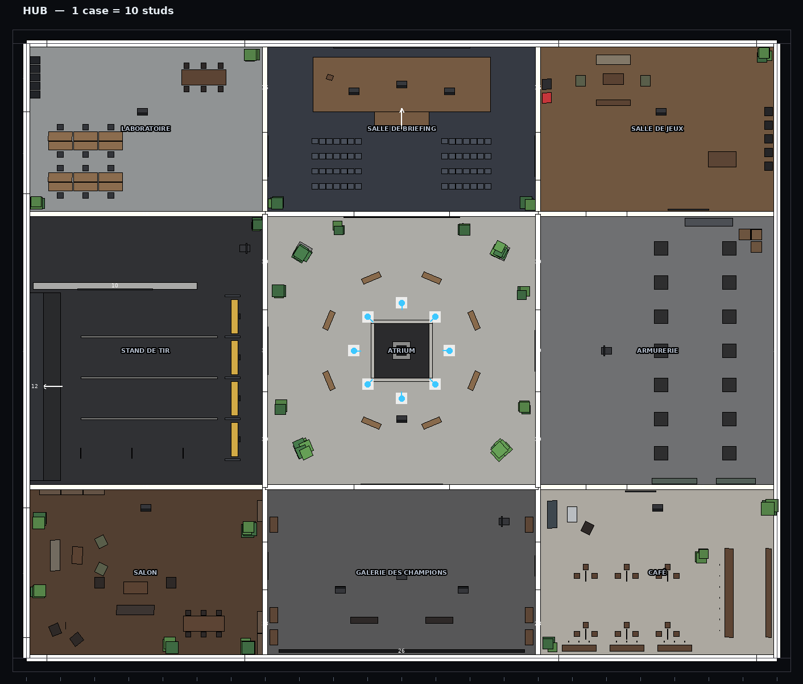

# 4. Hub — logique et flux complets

Le hub **AETHER SPIRE** (« Hub opérationnel — Niveau 88 ») est un *vrai lieu* : on y
marche en 3e personne, on y croise les autres joueurs (plaque nom · niveau · rang · titre),
chaque zone a une identité néon et un terminal. Tout ce qu'un menu permet est aussi
accessible physiquement — et inversement ([M] ouvre le même menu partout).



## 4.1 Zones et terminaux

| Zone | Couleur | Terminal (attribut `Action`) | Ouvre |
|---|---|---|---|
| **PLAZA** (centre, spawn en couronne) | cyan | `Play` (0, −20) | onglet JOUER |
| **RANKED TERMINAL** (nord, estrade) | ambre | `Ranked` ×3 | JOUER pré-réglé en CLASSÉ |
| **CASUAL BAY** (nord-est) | vert | `Casual` | JOUER pré-réglé en CASUAL |
| **CUSTOM LAB** (nord-ouest) | magenta | `Custom` | JOUER, section salons |
| **ARMORY** (est) | cyan | `Armory` + **14 socles** `WeaponPedestal` | ARMURERIE (le socle inspecté pré-sélectionne l'arme) |
| **TRAINING RANGE** (ouest) | vert | `Training` | panneau du stand (stats, boucliers des drones, munitions) |
| **HALL OF FAME** (sud) | ambre/cyan/magenta | `Leaderboard`, `Missions`, `Pass` + mur `LeaderboardDisplay` | CLASSEMENT, MISSIONS, PASS |
| **LOUNGES** (sud-ouest/sud-est) | — | `Play` ×2 | JOUER |
| Couloir sud-est | blanc | `Settings` | RÉGLAGES |

Implémentation : `Server/Maps/Blueprints/Hub.luau` (déclaratif) → `MapBuilder` pose le tag
`HubTerminal`, l'attribut `Action` et un `ProximityPrompt` [F] → `LobbyController`
écoute `ProximityPromptService.PromptTriggered` et ouvre `TERMINALS[action]`.
Les vitrines (`HubWorld`) exposent chaque arme **avec le skin équipé par le joueur**, en
lévitation et rotation lente, et un prompt « INSPECTER ».

## 4.2 Parcours d'un joueur

```
Connexion
 ├─ Boot (ReplicatedFirst) : écran de chargement dès la 1re frame
 ├─ DataService : chargement du profil avec VERROU de session (attente si un serveur de
 │   match le détient encore, vol après 20 s), migrations, réconciliation
 ├─ PlayerService : replica "PlayerProfile" (privé), attributs publics (niveau, rang, titre)
 ├─ PartyService : party solo créée (le joueur est leader)
 ├─ PlayerService.returnToHub : spawn à la PLAZA, arène "Hub", 3e personne
 ├─ Client : ClientBooted -> l'écran de chargement s'efface ; résumé post-match si un match
 │   non vu existe (LastMatch.seen = false)
 └─ MatchmakingService : match en cours trouvé dans AS_ActiveMatch ? -> modale « REJOINDRE ? »
```

## 4.3 Barre d'identité (temps réel)

Toujours visible au hub (`LobbyController.refreshTopBar`, déclenchée par chaque delta du
profil) : nom + titre, **niveau** + jauge d'XP (`Progression.xpForLevel`), **rang**
(glyphe et couleur du palier, division, RR) ou « PLACEMENT n/5 », **Flux** et **Cristaux**,
composition de la party. Les autres joueurs voient la même identité sur la plaque
au-dessus de votre tête (`CharacterAnimator.refreshPresentation`).

## 4.4 Party

Groupes de 1 à 3 (`PartyService`, replica `Party` répliqué aux membres) :

| Action | Qui | Règle |
|---|---|---|
| `Invite {target}` | leader | invitation avec TTL ; la cible reçoit une **modale** ACCEPTER/REFUSER |
| `Accept/Decline {partyId}` | invité | rejoint (quitte sa party solo) ou décline |
| `Kick {target}` | leader | l'exclu retrouve une party solo + toast |
| `Promote {target}` | leader | transfert du lead |
| `Lock {value}` | leader | party verrouillée : plus aucune invitation ne peut être acceptée |
| `SetMode {mode, value=ranked}` | leader | refusé si le mode n'existe pas dans cette file |
| `Leave` | membre | retour en solo |

**Toute modification de la party annule sa recherche** (le ticket ne correspond plus aux
joueurs) : `MatchmakingService` écoute `PartyService.Changed`.

## 4.5 File d'attente intelligente

**Conditions de recherche** (`MatchmakingService.join`) : appelant = leader, pas déjà en
recherche, mode disponible dans cette file (classée/casual), taille de party ≤ taille
d'équipe, profils chargés, aucun membre en match, niveau ≥ 3 pour le classé (hors Studio).

**Ticket** : `{ id, players, mmr = moyenne, minRank, maxRank, enqueuedAt, mode, ranked,
serverId }`.

**Algorithme** (`Shared/Rules/MatchmakingAlgorithm.luau`, pur, testé) :
1. Les tickets les plus anciens servent d'ancres.
2. Fenêtre de MMR = `min(600, 75 + 6 × attente)` ; en classé, écart de rang =
   `min(9, 3 + attente/20)` divisions.
3. Parmi les candidats compatibles les plus proches en MMR (10 max), sélection d'un
   ensemble de tickets totalisant **exactement** 2 × taille d'équipe joueurs — **une party
   n'est jamais séparée**.
4. Toutes les partitions en deux équipes sont énumérées (≤ 6 tickets → ≤ 32 partitions, le
   1er ticket étant fixé dans l'équipe A) ; score = écart de MMR moyen + 0.25 × dispersion.
   On joue le meilleur.

**Affichage** (widget permanent + onglet JOUER) : état (RECHERCHE / MATCH TROUVÉ),
temps écoulé, **estimation** (moyenne glissante des 20 dernières attentes de cette file ;
45 s par défaut), **joueurs en file**, largeur de recherche. Bouton ANNULER.

**Deux backends**, même algorithme :
- **Cloud** (production) : tickets dans une `MemoryStoreSortedMap` par file
  (`AS_MMQ_<Mode>:<R|C>`, TTL 90 s rafraîchi tant que le joueur attend). Un serveur lobby
  est **élu leader** (verrou `AS_MMLock` de 8 s) et forme les matchs pour tous les serveurs.
  Pour chaque proposition : `TeleportService:ReserveServer`, écriture de la `MatchSpec`
  dans `AS_MatchSpecs[privateServerId]` (TTL 600 s), **affectation** de chaque ticket dans
  `AS_MMAssign` ; chaque serveur lobby interroge les affectations de ses propres tickets
  et téléporte sa party (avec réessais). `AS_ActiveMatch[userId]` (30 min) permet la
  **reprise** après déconnexion. 5 échecs MemoryStore consécutifs → bascule automatique sur
  le backend local (le jeu reste jouable).
- **Local** (Studio, ou repli) : même file en mémoire, matchs lancés sur une arène du
  serveur lobby (`MatchService.startLocal`).

## 4.6 « Match trouvé » → chargement → match

```
Serveur : notifyFound(players, map, mode)  ──►  Client : LobbyController.onMatchFound
                                                  ├ ferme le menu, alerte « MATCH TROUVÉ »
                                                  │  (carte + mode), son, ducking audio
                                                  ├ ENVOL de la caméra (3 keyframes au-dessus
                                                  │  du QG, durée = compte à rebours − 0.6 s)
                                                  ├ prepareTeleport : écran de chargement
                                                  │  transmis à TeleportService
                                                  └ volets de transition « CHARGEMENT · CARTE »
Serveur match : lit sa MatchSpec (MemoryStore), attend les joueurs (Waiting),
                Intro : survol cinématique de la carte + présentation des équipes face à face
```

En local (Studio / salons personnalisés), l'arène est construite sur le même serveur :
même séquence, sans téléportation.

## 4.7 Retour au hub et écran de statistiques

Fin de match : écran VICTOIRE / DÉFAITE (MVP, vos stats), tableau final, puis
téléportation vers un serveur lobby (écran de chargement « RETOUR AU QG » transmis par
`SetTeleportGui`). Au hub, `PostMatch` joue une séquence chorégraphiée à partir de
`profile.LastMatch` (écrit par `ProgressionService.processMatch`) :

1. résultat + score (glitch), mode, carte ;
2. stats personnelles (K/D/A, dégâts, têtes, score, manches, MVP) ;
3. **XP ligne par ligne** (éliminations, assistances, headshots, premiers sangs, manches
   gagnées, objectifs — poses et désamorçages —, clutchs, aces, match terminé, victoire, MVP) avec compteurs, puis jauge de
   niveau qui se remplit (plusieurs tours si plusieurs niveaux, « NIVEAU SUPÉRIEUR ! ») ;
4. classé : jauge RR de l'ancien vers le nouveau total, delta signé, **promotion** mise en
   scène (son, libellé) ou rétrogradation sobre.

« CONTINUER » envoie `ProfileQuery {SeenLastMatch}` : l'écran ne réapparaît jamais.

## 4.8 Missions quotidiennes et défis hebdomadaires

`MissionService` + `Shared/Config/Missions.luau` : **3 quotidiennes** (1 changement par
jour) et **4 hebdomadaires**, tirées de façon **déterministe** (graine = jour/semaine +
joueur : pas de « reroll par reconnexion »). La progression s'incrémente en direct sur
`GameEvents` (éliminations par catégorie d'arme, têtes, wallbangs, glissades, poses,
désamorçages, victoires, matchs classés…) et se voit dans l'onglet sans rafraîchir.
Réclamation explicite → XP + Flux. Comptes à rebours de renouvellement (UTC ; semaine
commençant le lundi).

## 4.9 Rangs, niveaux, Pass, skins — en temps réel

- **Niveau** : 200 niveaux, `1500 + 125 × (niveau − 1)` XP par niveau, 100 Flux par niveau,
  récompenses jalons (niv. 5 emote, 10 skin P-10, 15 bannière, 20 skin VK-12, 30 effet
  Voltage, 40, 50 opérateur Night Ops, 75, 100).
- **Rang** : 8 paliers (RECRUIT → APEX × 3 divisions, puis AETHER), 5 matchs de placement
  (rang initial plafonné à l'index 14), MMR caché (Elo d'équipe) + RR visible. Détails :
  [10-code.md](10-code.md#105-rang--mmr-et-rr).
- **Aether Pass** « SAISON 1 — IGNITION » : 50 paliers × 3000 XP, piste gratuite (Flux tous
  les 2 paliers + cosmétiques) et premium (produit Robux). Réclamation par palier.
- **Skins** : changement d'équipement → mise à jour immédiate du viewmodel, du modèle
  3e personne vu par les autres (attribut `Skin`) et des vitrines du hub.

## 4.10 Armurerie 3D

Deux niveaux de lecture :
- **Monde** : 14 socles, chaque arme en lévitation avec **votre** skin, nom et nom de code.
- **Menu ARMURERIE** : liste par emplacement (principale / secondaire / lame), aperçu 3D
  en `ViewportFrame` (même constructeur procédural que le jeu : néons animés, aura),
  6 barres de stats **calculées** (dégâts, cadence, portée, précision, contrôle, mobilité),
  fiche technique (TTK bouclier plein, dégâts tête, one-tap, cadence, chargeur, rechargement,
  visée, pénétration, sensation recherchée), skins de l'arme triés par rareté (survol =
  aperçu, clic = équiper, double clic = acheter).

## 4.11 Autres flux

- **Training Range** : entrer dans la zone arme le joueur (loadout du profil, réserve
  infinie), passe en 1re personne, affiche le panneau de stats (précision, % tête, dégâts,
  éliminations). Couloirs statiques à 15/30/45 studs, arène de tracking à drones mobiles
  (Pathfinding + strafes + accroupissements). Sortir de la zone désarme.
- **Salons personnalisés** : création (code à 4 caractères), rejoindre par code, équipes
  A/B/spectateur, l'hôte choisit mode et carte (compatibles), LANCER → match local non
  classé.
- **Emotes** [B] : roue de 4 emplacements (configurés au Casier), joués procéduralement,
  visibles par tous (attribut `Emote`), interdits hors du hub (serveur).
- **Boutique** : objets achetables en Flux (raretés Commun 300 → Légendaire 3600 ; Mythique
  non achetable), produits Robux affichés uniquement s'ils sont configurés.
- **Réglages** : identiques au menu de match (voir [08-hud.md](08-hud.md)).

## 4.12 Caméra et transitions du hub

- 3e personne épaule droite (collision `Spherecast`, rapprochement instantané, éloignement
  amorti).
- **Caméra de menu** : à l'ouverture, la caméra glisse (0.55 s, smoothstep) pour cadrer le
  personnage dans le tiers gauche, le menu occupe la droite (flou d'arrière-plan).
- **Volets de transition** (`TransitionController`) : 7 lamelles qui balaient l'écran,
  logo glitché, statut — utilisés pour match trouvé, entrée/sortie d'arène, retour au QG.
