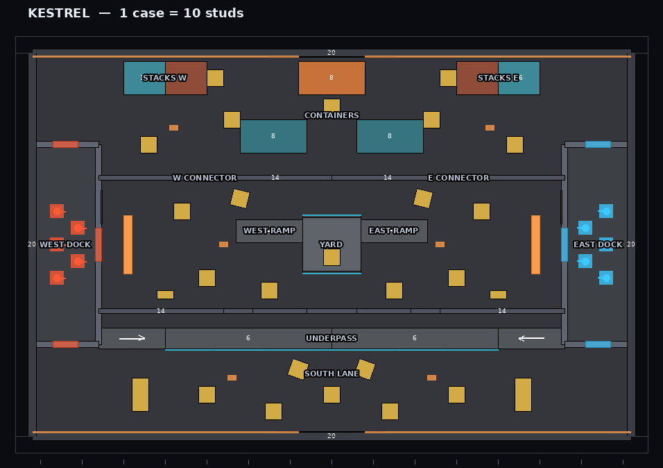
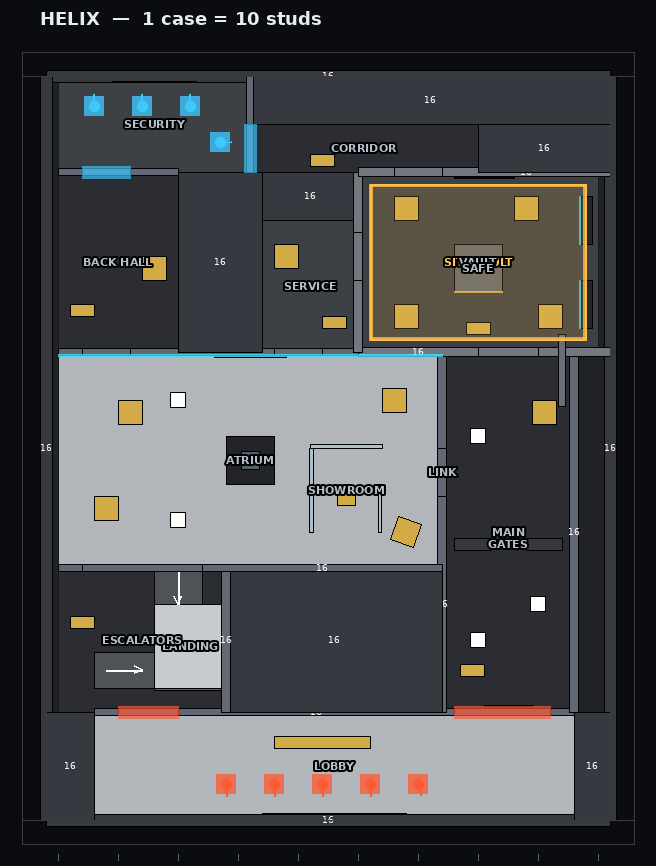
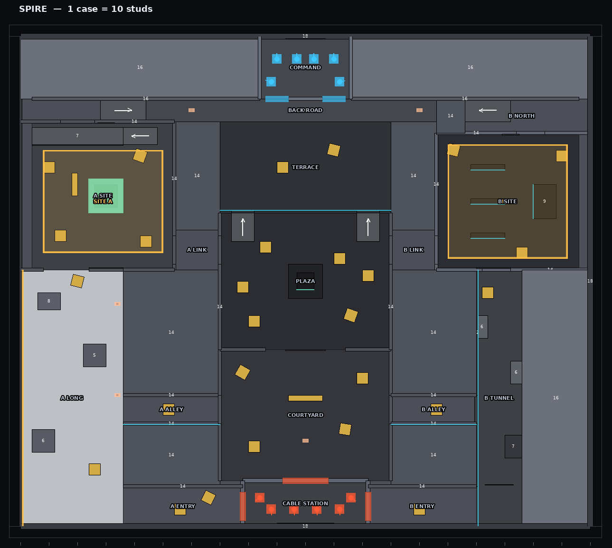
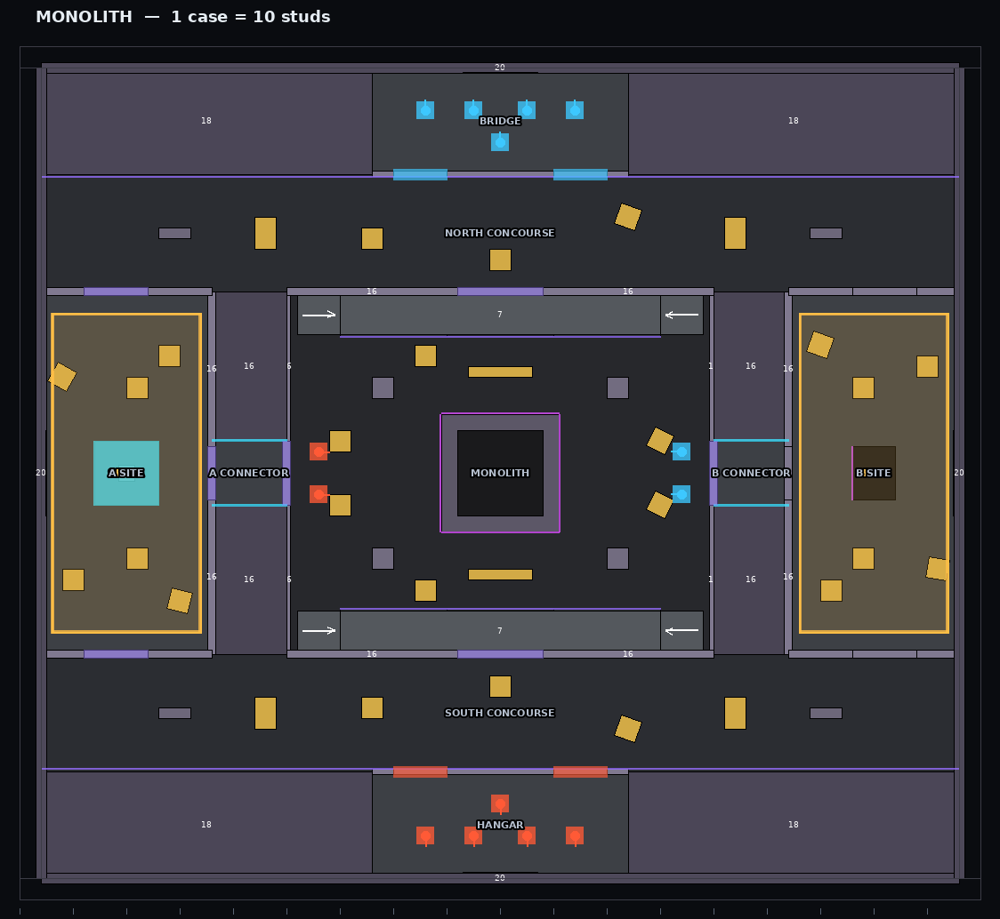

# 5. Philosophie de level design + 4 cartes

## 5.1 Philosophie

**Une carte compétitive est un instrument de mesure** : elle doit départager deux équipes
sur la *décision* et la *visée*, jamais sur la connaissance d'un bug ou d'un pixel. Règles
appliquées à toutes les cartes :

1. **Grammaire de couverture fondée sur la géométrie des hitboxes** (`Shared/Combat/Stances.luau`)
   - Debout : oeil à **4.7** studs ; accroupi : oeil à **3.3**, sommet du crâne à **3.77**.
   - Caisse standard **4 studs** (`kit:crate`, taille par défaut) : cache **entièrement**
     un joueur accroupi, laisse dépasser la tête d'un joueur debout → on choisit entre
     « voir » et « être vu ». Couvertures basses **3.2** : protègent le torse debout.
   - Murs pleins ≥ 7 studs : aucune information au-dessus.
   La même géométrie sert aux hitboxes et à la caméra : ce que l'on voit en se penchant
   (lean ±0.55 stud, ±12°) est exactement le volume touchable.
2. **Trois voies lisibles** par carte, chacune avec un rythme propre (angles courts /
   duel ouvert / long axe), reliées au milieu par un **mid** qui se paie cher mais donne
   l'information et les rotations.
3. **High ground jamais gratuit** : toute position dominante est exposée sur plusieurs
   faces ou accessible par une rampe bruyante (grilles en `DiamondPlate` = pas métalliques).
4. **Anti-spawnkill structurel** : barrières de préparation devant chaque spawn
   (`SpawnBarrier`, actives pendant `Prep`), **bloqueurs** devant les portes de spawn, et
   **aucune ligne de vue entre spawns ennemis** — vérifiée automatiquement par un test
   (`tests/specs/maps.luau`, rayon/OBB sur toutes les paires de spawns, oeil debout) et par
   `MapBuilder.validate` en Studio.
5. **Pénétration lisible** : verre (0.15), tissu (0.3), bois (0.6–0.7) se traversent ;
   béton (1.6), métal (2.4) et tôle à pointes de diamant (3.0) arrêtent la plupart des
   armes (`Ballistics` : budget de pénétration × épaisseur × résistance). Les vitrines et
   cloisons fines sont **placées** pour créer des wallbangs intentionnels.
6. **Le son est un outil de level design** : matériaux de sol → pas différenciés (métal,
   doux, défaut), occlusion par la géométrie, réverbération en intérieur.
7. **Callouts physiques** : chaque zone nommée a un volume `CalloutZone` et un panneau
   néon ; les noms sont courts et non ambigus (« STACKS W », « A LONG », « B TUNNEL »).
8. **Lisibilité visuelle** : palette froide neutre, néons d'équipe (attaque orange-rouge,
   défense cyan) sur les pads de spawn, sites encadrés d'ambre, contour ennemi optionnel
   (Highlight `Occluded`, couleur d'accessibilité réglable).

## 5.2 Pipeline de fabrication

```
Blueprint (DSL MapKit, déclaratif)  ──►  MapBuilder.build(blueprint, origine, parent, mode)
  floor/wall/wallDoor/window/ramp/          ├ pièces + styles de matériaux
  crate/cover/platform/pillar/              ├ tags CollectionService + attributs
  spawn/barrier/modeBarrier/site/           ├ filtrage par MODE (ModeBarrier, spawns et sites
  callout/zone/terminal/light/sign            "Modes") : une carte, plusieurs configurations
                                            ├ panneaux, lumières, invites
                                            └ intro/overview exposés en attributs (client)
Revue hors Studio : lune run tools/export_maps.luau && python3 tools/render_maps.py
                    -> docs/maps/*.png (vue de dessus cotée, 1 case = 10 studs)
Tests            : spawns par côté, sites par mode, ≥ 8 callouts, 4 limites,
                   aucune ligne de vue entre spawns ennemis
```

Le blockout procédural est **jouable et final pour le gameplay** ; l'habillage artistique
(meshes, décals) se pose ensuite **sans toucher** aux volumes de collision et aux tags.

## 5.3 Système de manches par mode

| Mode | Format | Victoire | Mi-temps | Manche | Préparation | Uplink (pose / désamorçage / mèche) | Manches pistolet | Prolongation |
|---|---|---|---|---|---|---|---|---|
| **DUEL** | 1v1 Élimination | 7 manches | après 6 | 60 s | 6 s | — | non | oui (max 4) |
| **WINGMAN** | 2v2 Attaque/Défense, 1 site | 7 | après 6 | 90 s | 10 s | 4 s / 7 s / 40 s | oui | oui (max 4) |
| **SQUAD** | 3v3 Attaque/Défense, 2 sites | 8 | après 7 | 100 s | 12 s | 4 s / 7 s / 40 s | oui | oui (max 6) |
| **CLASH 2v2** | Élimination par manches | 5 | après 4 | 75 s | 8 s | — | non | non |
| **CLASH 3v3** | Élimination par manches | 5 | après 4 | 90 s | 8 s | — | non | non |

Règles (`Shared/Rules/MatchRules.luau`, testées) :
- **Élimination** : équipe entièrement éliminée = manche perdue ; temps écoulé = l'équipe
  avec le plus de survivants puis le plus de PV restants gagne (sinon nulle).
- **Uplink** : l'attaque porte une charge (un porteur désigné, ramassable si lâchée), la
  pose prend 4 s **immobile sur un site** (annulée si l'on bouge > 2.5 studs) ; posée, la
  mèche dure 40 s ; la défense désamorce en 7 s à moins de 4.5 studs, **point de
  sauvegarde à 50 %** (une interruption ne fait pas tout perdre). Attaque gagne :
  élimination de la défense ou détonation ; défense gagne : élimination de l'attaque
  (avant la pose), désamorçage ou temps écoulé sans pose.
- **Prolongation** : à égalité à la balle de match, il faut **2 manches d'écart** ; au-delà
  du plafond, mort subite. **Balle de match** annoncée.
- **Manches pistolet** (1re de chaque mi-temps en Wingman/Squad) : principale retirée,
  **sans bouclier**.
- **Échange de côtés** à la mi-temps (bannière « CHANGEMENT DE CAMP »).

---

## 5.4 KESTREL YARD — Duel 1v1 / Clash 2v2



**Identité.** « Dépôt de fret sur toit — Secteur 7 ». Néo-industriel nocturne :
conteneurs, passerelles, lampes au sodium, pluie. Éclairage : 0 h 30, luminosité 1.2,
exposition +0.2, atmosphère dense (0.38, voile 2.2), étalonnage chaud (teinte 255/240/225,
contraste +0.16, saturation −0.05). Ambiance sonore `Ambient.Industrial`.
Emprise 140 × 96 studs, 184 primitives.

**Structure.** **Symétrie miroir** (x → −x) : équité parfaite pour le duel.
Trois voies nord → sud :
- **CONTAINERS / STACKS W·E** (nord) : CQB, angles courts, conteneurs escaladables via les
  caisses (**CONTAINER TOP** = hauteur 8) — terrain des SMG et du pompe.
- **YARD** (centre) : duel ouvert autour de la **TOWER** (high ground central, rampes
  **WEST RAMP / EAST RAMP**), exposée sur 4 faces : la prendre donne l'info, la tenir coûte cher.
- **SOUTH LANE / CATWALK / UNDERPASS** (sud) : long axe, passerelle surélevée (y = 6) au-dessus
  du passage couvert ; la **WINDOW** permet de contester le Yard depuis le sud sans y entrer.

**Callouts.** WEST DOCK, EAST DOCK, WEST RAMP, EAST RAMP, W CONNECTOR, E CONNECTOR,
STACKS W, STACKS E, YARD, TOWER, CONTAINERS, CONTAINER TOP, CATWALK, WINDOW, UNDERPASS,
SOUTH LANE.

**Chokepoints.** Les trois portes de chaque DOCK (nord, est, sud) ; les connecteurs
W/E dans le mur z = 16 ; l'entrée de l'UNDERPASS.

**Rotations.** Connecteurs W/E (nord ↔ yard), UNDERPASS (sud ↔ yard). Le joueur qui tient la
TOWER voit les deux rotations : c'est le « mid » qui décide des rounds de Clash.

**Spawns.** WEST DOCK et EAST DOCK, derrière des **bloqueurs** placés devant les portes :
aucune ligne de vue TOWER → spawn ; barrières de préparation sur les 3 portes de chaque dock.

**Streaming.** Petite carte compacte (rayon < 90 studs) : entièrement chargée dès le
spawn ; en match, modèle `PersistentPerPlayer` / `Persistent`.

---

## 5.5 HELIX VAULT — Wingman 2v2 (site unique) / Clash



**Identité.** « Chambre forte Helix Bank — Étage 140 ». Banque corporatiste high-tech :
marbre noir, verre, lumière blanche clinique. Éclairage : 14 h, luminosité 2.2, exposition 0,
atmosphère légère (0.25), étalonnage froid (teinte 240/248/255, saturation −0.1).
Ambiance `Ambient.Hum`. Emprise 150 × 120, 169 primitives. **Carte intérieure, asymétrique.**

**Structure.**
- **Attaque** : LOBBY (sud) → trois routes :
  - **MAIN / GATES** (directe, contrôlée par les portiques) ;
  - **ATRIUM** (mid vitré) → **SERVICE** → porte ouest du vault ;
  - **ATRIUM** → **LINK** → MAIN (flanc).
- **Défense** : SECURITY (nord-ouest) → accès nord direct au site (≈ 3 s), ou **BACK HALL** →
  ATRIUM pour contester le mid et prendre l'info.
- **Site VAULT** (encadré ambre) autour du **SAFE** central : deux entrées attaquantes
  (MAIN, SERVICE), une entrée défensive (CORRIDOR).

**Callouts.** LOBBY, MAIN, GATES, ESCALATORS, LANDING, ATRIUM, SHOWROOM, LINK, BACK HALL,
SERVICE, VAULT, SAFE, CORRIDOR, SECURITY.

**Chokepoints.** Portiques de MAIN (portes étroites), porte de SERVICE, débouché du LINK.

**High ground.** ESCALATORS → LANDING (verticalité côté attaque) : voir l'atrium depuis
l'étage, au prix d'une descente exposée.

**CQB.** SERVICE et CORRIDOR (couloirs étroits) : fusil à pompe / SMG.

**Wallbangs intentionnels.** Les vitrines de l'ATRIUM et du SHOWROOM sont en verre
(résistance 0.15) : on peut tirer à travers, et l'on **entend** les déplacements derrière.

**Spawns.** LOBBY (attaque, 5 points) et SECURITY (défense) aux extrémités opposées,
barrières sur les sorties du lobby pendant la préparation.

---

## 5.6 SPIRE-9 — Squad 3v3 (sites A et B) / Clash 3v3



**Identité.** « Complexe de recherche — Falaise de Vael ». Station scientifique sur
falaise gelée au crépuscule : réacteur, datacenter, téléphérique. Éclairage : 17 h 36,
luminosité 2.4, exposition +0.05, sun rays marqués (0.12), étalonnage légèrement saturé
(+0.05). Ambiance `Ambient.Wind`. Emprise 200 × 170, 246 primitives (la plus grande).

**Structure.** Trois routes d'attaque de natures différentes depuis la **CABLE STATION**
(spawn attaque, sud) :
- **A LONG** (ouest, extérieur sur la falaise) : longues lignes de vue → snipers et DMR.
  Débouche sur **A SITE (A REACTOR)**, site extérieur ouvert, avec **A HEAVEN** surélevé.
- **MID** : **COURTYARD** → **PLAZA** (autour de la flèche centrale) → **A LINK / B LINK** :
  choix tardif du site. La **TERRACE** (y = 5, high ground) domine la plaza.
- **B TUNNEL** (est) : couloir CQB → **B SITE (B DATACORE)**, intérieur, close-range.
  Alternative : **B ALLEY**.

**Défense.** **COMMAND** (nord, y = 5) → **BACK ROAD** surélevée vers les deux sites
(≈ 5 s) ; **B NORTH** et rampes de la terrasse pour contester le mid. Le mid se paie cher,
mais il donne les deux sites.

**Callouts.** CABLE STATION, A ENTRY, A ALLEY, A LONG, COURTYARD, B ENTRY, B ALLEY,
B TUNNEL, PLAZA, A LINK, B LINK, TERRACE, BACK ROAD, COMMAND, A SITE, A HEAVEN, B SITE,
B NORTH.

**Chokepoints.** Sortie d'A LONG sur le site A, LINKs vers les sites, bouche du B TUNNEL,
« CHOKE » sud de la plaza.

**Rotations.** Défense : BACK ROAD (rapide, surélevée). Attaque : COURTYARD (sud, entre
A ENTRY et B ENTRY). Toutes les zones mortes sont des volumes pleins : **aucune cachette
exploitable**.

**Spawns.** CABLE STATION (attaque, 7 points en arc) et COMMAND (défense, 6 points) aux
deux extrémités nord/sud, barrières de préparation sur les sorties.

**Streaming.** La plus grande carte (rayon ≈ 130 studs) : en lobby, l'arène est
`PersistentPerPlayer` (chargée en entier pour les participants uniquement) ; le
`StreamingTargetRadius` (768) couvre toute la carte.

---

## 5.7 MONOLITH — carte polyvalente (Duel, Wingman, Squad, Clash)



**Identité.** « Relais orbital Aether-0 ». Station spatiale autour d'un **monolithe noir de
44 studs** qui bloque toute ligne de vue au centre : verticalité, magenta et vide étoilé.
Éclairage : 2 h, luminosité 1.1, exposition +0.15, bloom fort (0.9), saturation +0.12,
teinte 248/238/255. Ambiance `Ambient.Hum`. Emprise 176 × 150, 219 primitives.

**Structure.** Anneau central (**RING**) autour du **MONOLITH**, ceint de deux **balcons**
(N et S, y = 7, accès par rampes à claire-voie), deux **connecteurs** (A, B) vers les
sites latéraux **A SITE (ARRAY)** et **B SITE (RELAY)**, deux **concourses** (nord, sud)
qui relient les spawns **BRIDGE** (défense, nord) et **HANGAR** (attaque, sud) aux sites.

**Une carte, quatre configurations** (barrières `ModeBarrier`, spawns et sites filtrés par
l'attribut `Modes`) :
- **Duel** : les 4 portes de l'anneau sont scellées → arène centrale 80 × 68 autour du
  monolithe, spawns dédiés est/ouest, élimination pure.
- **Wingman / Clash 2v2** : site A scellé → carte à un site, plus compacte.
- **Squad / Clash 3v3** : carte complète, deux sites.

**Callouts.** RING, MONOLITH, NORTH BALCONY, SOUTH BALCONY, A CONNECTOR, B CONNECTOR,
A SITE, B SITE, NORTH CONCOURSE, SOUTH CONCOURSE, HANGAR, BRIDGE.

**Chokepoints.** Portes de l'anneau (WEST/EAST GATE), connecteurs A/B, portes des
concourses vers les sites.

**High ground.** Balcons N/S : dominent l'anneau, mais visibles depuis les deux portes et
accessibles par des rampes métalliques bruyantes. Pylônes : couverture en hauteur.

**Spawns.** HANGAR (attaque, sud) et BRIDGE (défense, nord), séparés par le monolithe et
deux murs pleins : ligne de vue impossible (test automatique).

---

## 5.8 Éclairage de match et lisibilité

- `Lighting.Technology = Future` : ombres dynamiques des néons et des projecteurs.
- Profils par carte (ci-dessus) appliqués côté serveur (`MapService.applyLighting`) et côté
  client (`LightingController.applyMap`) — un serveur lobby qui héberge des matchs locaux
  applique le profil de la carte **pour les seuls participants**.
- Contraste ennemi garanti : chaque joueur garde son avatar Roblox (gros accessoires retirés
  en match, `Rules/AvatarRules`), contour ennemi
  `Highlight` en mode **Occluded** (n'apparaît que sur les pixels réellement visibles —
  jamais à travers un mur), couleur réglable (rouge, jaune « deutéranopie », violet
  « tritanopie »).
- Aucune zone noire « camping » : chaque couverture reçoit une lumière d'appoint
  (`kit:light`, `kit:panelLight`, `kit:lamp`).

## 5.9 Optimisation StreamingEnabled

| Élément | Réglage |
|---|---|
| Serveur | `StreamingEnabled`, `StreamingMinRadius 96`, `StreamingTargetRadius 768`, `StreamingIntegrityMode PauseOutsideLoadedArea` (aucun joueur ne tombe dans une zone non chargée) |
| Arène de match (serveur réservé) | `ModelStreamingMode = Persistent` |
| Arène locale (lobby / Studio) | `PersistentPerPlayer` + `AddPersistentPlayer(participant)` : entièrement chargée pour les joueurs du match, jamais pour les autres |
| Hub | streaming standard ; vitrines et mur de classement attachés à l'arrivée des pièces |
| Client | tout repose sur les signaux de tags (pas d'énumération figée au démarrage) |
| Budget | 169–246 primitives par carte, matériaux natifs, aucun mesh : chargement < 1 s |

## Habillage (refonte)

Les plans restent des blockouts jouables testés ; l'habillage est une couche séparée
(`src/Server/Maps/Dressing/<Carte>.luau`, recettes dans `src/Server/Maps/Decor.luau`)
appelée à la fin de chaque plan. Trois catégories :

| Groupe | Règle (testée) | Exemples |
|---|---|---|
| `Decor` | ni collision ni requête ; fin (≤ 1 stud) ou base ≥ 12 studs | joints, plinthes, nervures de conteneurs, arêtes de caisses, tuyaux, câbles, marquages, appliques, écrans, poutres, portiques |
| `Backdrop` | ni collision ni requête ; hors des limites ou sous le sol | tours, grues, montagnes, téléphérique, coque de station, planète |
| `Props` | vraie géométrie (collision, lignes de vue) ; seulement en zone de spawn ou au hub | canapés, plantes, bar, trophées, bornes |

Ainsi, ce qu'on voit est ce qui bloque : aucune fausse couverture, aucune cachette
visuelle, et les métriques du plan (lignes de vue, temps de rotation) sont inchangées.
Rendus avant/après : `docs/renders/`, outil `tools/render_view.py`.
