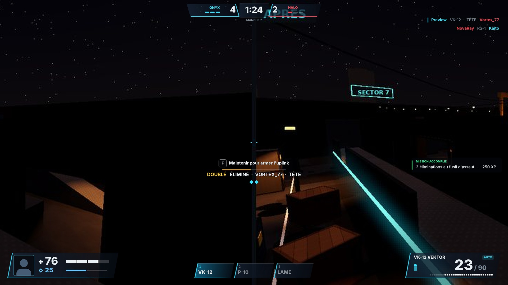
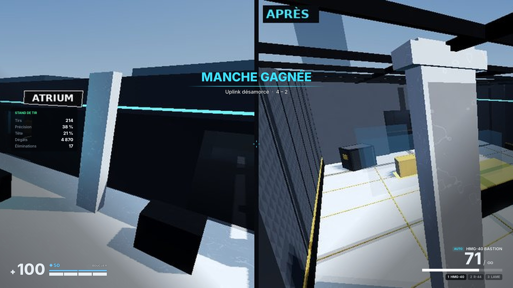

# 8. HUD ultra-premium — description précise et logique

> Code : `Client/Controllers/HUDController.luau` (combat, état → affichage),
> `Client/UI/HudWidgets.luau` (construction des éléments), `MatchController.luau`
> (intro, killcam, spectateur, fin), `Lobby/*` (hub), `UI/UI.luau` (kit), `UI/SettingsPanel.luau`,
> `Controllers/OptionsController.luau` (options rapides).
> Principe : **lisible en une fraction de seconde**, aucune logique de jeu dans le HUD — il
> ne fait que lire l'état (`WeaponController.hudState()` sans allocation, replicas, attributs)
> et réagir aux événements confirmés par le serveur.

## 8.1 Disposition (référence 1080p)

Aperçus produits hors Studio : `lune run tools/ui_preview.luau hud scene.json` construit la
scène avec les vrais modules d'UI, `python3 tools/render_ui.py scene.json hud.jpg --bg
docs/renders/kestrel_intro4.jpg` la dessine (mise en page Roblox : UDim2, ancres, listes,
tailles automatiques, coins, contours, dégradés, texte riche ; Builder Sans ≈ Inter).

**Direction (refonte v3)** : **verre sombre biseauté**. Les blocs du bas sont des
parallélogrammes « / » (`UI.glass` : un seul Frame découpé par un UIGradient à paliers nets,
angle calculé en espace UV) en verre bleu nuit, liseré cyan sur le bord oblique, filet
lumineux au pied ; plaques d'ombre douces derrière pour la lisibilité sur ciel clair.
Bas-gauche : **portrait de l'avatar** + santé / bouclier (barres segmentées, paliers de 25) ;
bas-centre : **barre d'armes** à trois emplacements ; bas-droite : munitions (cartouche,
chargeur, réserve, cartouches restantes). Barre de match en haut au centre : chrono, équipes
en biseaux symétriques (`mirrored`), lueur aux couleurs d'équipe. Killfeed, notifications,
panneau du stand et écran de fin de match reprennent le même verre. Icônes dessinées en
Frames (croix, écusson, cartouche) : aucun asset.

**Écran Roblox respecté** : rien en haut à gauche ni en haut à droite du HUD de combat ; au
lobby, la carte d'identité, le portefeuille et l'engrenage d'options suivent
`GuiService.TopbarInset` (`UI.topbarClearance`, `UI.onTopbarChanged`) et ne passent jamais
sous les boutons Roblox.

**Mobile** : les commandes tactiles occupent les coins bas (joystick dynamique à gauche,
TIR / VISER / SAUT à droite) ; sur mobile, vie et munitions montent hors des zones du pouce
(échelle 0,8, sans ombre) et la barre d'armes est masquée (bouton ARME).

**Guide des premières sessions** (`Shared/Rules/Onboarding`, testé) : une seule consigne
sous la carte d'identité du hub — stand de tir (distance en mètres), première partie,
missions à réclamer — puis plus rien après 3 parties.

Deux calques : **Combat** (armé, 1re personne : réticule, vitals, munitions, boussole…) et
**Overlay** (toujours visible pendant un match : bannières, killfeed) — un joueur mort ou
spectateur voit toujours les annonces et le fil des éliminations.

## 8.2 Réticule dynamique et personnalisable

| Réglage | Plage | Défaut |
|---|---|---|
| Style | CLASSIQUE (4 branches), POINT, CERCLE, EN T | Classique |
| Couleur | Cyan, Vert, Blanc, Or, Rouge, Violet, Rose | Cyan `#3DE1FF` |
| Opacité | 10–100 % | 100 % |
| Épaisseur / Longueur / Écart | 1–6 / 0–20 / 0–20 px | 2 / 6 / 4 |
| Contour + épaisseur + opacité | on/off, 0–3 px, 0–100 % | oui, 1, 60 % |
| Point central + taille | on/off, 1–8 px | non, 2 |
| **Dynamique** | on/off | oui |

**Le réticule dynamique représente le VRAI cône** : `écart = Gap + tan(cône) / tan(FOV/2) ×
(hauteur/2) / échelle_UI`. Quand il s'ouvre (mouvement, saut, bloom), les balles s'ouvrent
**exactement** autant. Un ressort ajoute un « kick » visuel à chaque tir. Il **s'efface
pendant la visée** (fondu entre 30 % et 70 % d'ADS — les viseurs prennent le relais),
disparaît en lunette, se réduit à un point avec la lame. Éditeur avec **aperçu en direct**
(×2) dans les réglages.

## 8.3 Munitions et arme (bas-droite)

- Nom de l'arme en capitales et **pastille du mode de tir** (AUTO / SEMI / RAFALE / VERROU /
  POMPE / LAME).
- **Chargeur** en grand (62 px ExtraBold) : léger « pop » d'échelle à chaque tir ;
  **ambre** sous 30 %, **rouge** à vide. Réserve « / 90 » atténuée (∞ au stand de tir).
- **Cartouches** : une case par balle (chargeurs ≤ 40), sinon une barre continue ; les balles
  tirées s'éteignent de gauche à droite.
- **Barre de rechargement** fine sous les cartouches (progression réelle du clip).
- **Emplacements** 1 / 2 / 3 en pastilles sombres (nom court) ; l'arme active est blanche.
- Invite clignotante « RECHARGER [R] » (touche réelle des réglages) quand le chargeur est vide.

## 8.4 Santé et bouclier (bas-gauche)

- Croix de santé + PV en grand (58 px ExtraBold) ; bouclier (◆ + valeur) en bleu clair.
- **Barres segmentées à traînée** : santé en 4 cases de 25 PV, bouclier en 2 cases de 25 ;
  la partie perdue reste blanche 0.35 s puis se résorbe en 0.45 s — on lit l'ampleur d'un
  impact et le palier atteint d'un coup d'œil.
- **Bas PV** (< 35 %) : chiffres et barre en rouge, **vignette rouge pulsée** (fréquence
  croissante), battement de cœur, passe-bas sur les SFX, désaturation de l'image.
- Impact reçu : flash de vignette 0.18 s, flash d'éclairage, **aberration chromatique
  simulée** (franges cyan/rouge en bord d'écran), punch et secousse caméra, son « Hurt »,
  son spécifique si tête.

## 8.5 Indicateurs de dégâts directionnels

Arc rouge autour du centre (rayon 150 px) orienté vers **la position du tireur au moment
du tir**, **recalculé chaque frame** selon votre orientation (si vous vous tournez, l'arc
tourne). Intensité selon les dégâts, durée 1.6 s (fondu après 0.6 s), 6 simultanés max.

## 8.6 Hitmarkers, chiffres, confirmation

- Hitmarker en X (4 traits avec contour) : **blanc** corps, **or** tête, **cyan** bouclier
  brisé, **rouge agrandi** élimination ; « pop » d'échelle ; désactivable.
- Chiffres de dégâts **dans le monde** (ScreenGui sans mise à l'échelle → pixels exacts),
  **cumulés par victime** (0.75 s), montent et s'effacent en 1.1 s ; or = tête, ambre =
  à travers un mur ; désactivables.
- Confirmation d'élimination sous le réticule + séries (DOUBLÉ, TRIPLÉ, QUADRUPLÉ, ACE) +
  **pastilles** losanges des kills de la manche (or à 5).

## 8.7 Killfeed (haut-droite)

Jusqu'à 5 lignes (la plus récente en haut), 6 s puis fondu, sur pastilles sombres. Format :
`Tueur   ARME · TÊTE · À TRAVERS · SANS VISÉE   Victime` (mentions en clair, aucun glyphe
exotique). Couleurs d'équipe **relatives** (vos alliés en cyan, ennemis en rouge). Vos lignes
ont un **liseré** à gauche (cyan si vous avez tué, rouge si vous êtes mort). Chute hors carte
= « CHUTE ».

## 8.8 Boussole

Bande de 420 px montrant 120° (lettres cardinales + graduations tous les 15°), dégradé aux
bords, repère central. **Marqueur d'objectif** : position de l'uplink (ambre ; **rouge** une
fois armé), borné aux bords quand il est hors champ. Désactivable. (Choix de design :
**boussole plutôt que minimap** — une minimap révélerait trop d'information sur les cartes
compactes ; les appels vocaux/callouts restent la source d'info d'équipe.)

## 8.9 Barre de match (haut-centre)

- Votre équipe **toujours à gauche** (cyan), l'adversaire à droite (rouge) : scores dans
  des cases sombres soulignées de la couleur d'équipe, noms de camp (ONYX = attaque, HALO =
  défense) à l'extérieur.
- **Survivants** : une pastille par joueur, pleine si vivant.
- **Timer** : `m:ss` ; **ambre** sous 10 s en phase de combat ; uplink armé → timer de mèche
  en **rouge**, au dixième, pulsant sous 10 s.
- Ligne d'état en pastille sous le timer : « MANCHE 7 · PROLONGATION · PRÉPARATION / FIN DE
  MANCHE / … ».

## 8.10 Tableau des scores [Tab]

Plein écran translucide : carte · mode · manche ; par équipe (la vôtre d'abord) : nom de
camp + score, colonnes **K, D, A, DÉGÂTS, SCORE**, glyphe et couleur de rang, ★ MVP,
« (déconnecté) », votre ligne surlignée, morts grisés ; tri par score ; rafraîchi 2 fois/s.
Forcé à l'écran en fin de match.

## 8.11 Notifications

- **Bannières** centrales (Builder Sans ExtraBold 46 px, ligne d'accent dégradée qui
  s'étend, sous-titre) :
  MANCHE n (+ PISTOLET / PROLONGATION / BALLE DE MATCH), ENGAGEZ, UPLINK ARMÉ (défendez /
  neutralisez + site), UPLINK NEUTRALISÉ, UPLINK LÂCHÉ, MANCHE REMPORTÉE / PERDUE / NULLE +
  raison, CHANGEMENT DE CAMP, CLUTCH, ACE.
- **Toasts** (coin droit, partout y compris au hub) : récompense (couleur de rareté),
  niveau, rang, mission terminée, palier de Pass, achat, erreur, info — avec son.
- **Modales** (hub) : invitation de party, reprise de match.

## 8.12 Interaction et objectif

Invite contextuelle sous le réticule : la **touche en pastille** ([F] ou la touche choisie)
suivie de l'action, « Maintenir pour armer l'uplink · site A », « Maintenir pour
neutraliser · 50 % conservés » ; **la barre de progression suit l'horloge serveur**
(`plantEndsAt` / `defuseEndsAt`) : ce que vous voyez est exactement ce qui compte. Badge
« ◆ UPLINK EN VOTRE POSSESSION » pour le porteur ; étiquettes « SITE A/B » dans le monde.

## 8.13 Lunette

Lentille circulaire calée sur la **hauteur** de l'écran (identique en 16:9, 21:9, 4:3),
masque noir autour, anneau intérieur, réticule fin et point rouge ; le modèle d'arme est
masqué ; profondeur de champ dédiée côté éclairage (premier plan flouté, cible nette).

## 8.14 Spectateur, killcam, fin de match

- **Killcam** : bandeau « KILLCAM · TUEUR · ARME · TÊTE · PV n BOUCLIER n » + marqueur
  « ◆ VOUS » sur votre position dans le replay.
- **Spectateur** : bandeau « SPECTATEUR · NOM · [CLIC G] SUIVANT » ; à défaut de coéquipier
  vivant, vue d'ensemble de l'arène.
- **Fin de match** : VICTOIRE (or) / DÉFAITE (rouge) / ÉGALITÉ, score, carte MVP, vos stats,
  puis tableau final.

## 8.15 Responsive : desktop, tablette, mobile

- Chaque ScreenGui a un `UIScale` = clamp(hauteur / 1080, 0.55, 1.25) (mobile :
  hauteur / 820, 0.5–1.1) × **échelle HUD** des réglages (70–130 %) ; recalculé au
  redimensionnement.
- Ancres aux coins (marges 24–32 px) : rien ne passe sous les encoches ; les éléments
  centrés utilisent des positions relatives.
- **Mobile** : joystick flottant (moitié gauche), visée par glissement (moitié droite),
  boutons TIR (×2, dont un à gauche pour la prise « griffe »), VISER, RECH., ARME, F,
  TAB, SAUT, ACCR., MENU ; le bouton TIR est **aussi une zone de visée** ; friction de visée
  légère sur cible (jamais de verrouillage).
- Manette : gâchettes (tir/visée), A saut, B accroupi, L3 sprint, X recharger, Y arme suivante, croix
  (lean, inspecter, interagir), Select (tableau), Start (menu).

## 8.16 Réglages (lobby et menu de match)

**Options rapides partout** (touche **P**, ou l'engrenage en haut à droite au hub et au stand
de tir) : sensibilité en premier — curseur **logarithmique** (précis aux petites valeurs),
**valeur exacte au clavier** (cliquer le chiffre, taper, Entrée) et pas fins − / + de 0,01 —,
multiplicateur en visée, champ de vision, volumes, sprint en bascule, puis « Tous les
réglages ». La fenêtre libère la souris et met le jeu en pause côté entrées.

6 onglets, application **en direct**, sauvegarde serveur regroupée (1.5 s) et validée :
- **Contrôles** : sensibilité (0.05–5, mêmes curseur log + saisie + pas fins),
  multiplicateurs visée/lunette, inverser Y, bascules (visée, accroupi, sprint, marche),
  lean, rechargement automatique.
- **Réticule** : voir 8.2 (aperçu en direct).
- **Vidéo** : FOV 60–95°, secousses, balancement tête/arme (0–150 %), bloom, profondeur de
  champ, rayons de soleil, **flashs réduits** (photosensibilité), FPS.
- **Audio** : général, musique, effets, interface ; sons de touche / d'élimination.
- **HUD** : échelle, chiffres de dégâts, hitmarkers, boussole, stats réseau, killcam,
  **couleur des ennemis** (rouge / jaune « deutéranopie » / violet « tritanopie »).
- **Touches** : rebinding de 18 actions (clavier + souris, dont Sprint = Maj, Marcher = Alt,
  Options = P), conflits résolus par échange, Échap pour annuler, réinitialisation.

## 8.17 Transitions de HUD

HUD masqué pendant l'intro de carte, la killcam et l'écran de fin ; réapparition au
spawn (flash noir 0.35 s) ; bannières et killfeed persistants ; aucun élément ne « saute »
(tweens `Theme.tween.fast/medium/slow/bounce`).

## Accessibilité (refonte)

- Contraste : `textFaint` (états désactivés, indices) relevé à ≥ 3:1 ; toute information
  lisible utilise `text` ou `textDim` (≥ 5:1). Contrôle : `contrast.py` du skill
  `roblox-ui-design-system`.
- `GuiService.ReducedMotionEnabled` : animations d'interface instantanées, secousses et
  balancement de caméra atténués (la visée et le recul réel ne changent jamais).
- `GuiService.PreferredTransparency` : panneaux plus opaques si l'utilisateur le demande.
- Zone sûre : santé, munitions, boussole et killfeed restent hors des encoches et coins
  arrondis des téléphones ; les overlays plein écran couvrent tout l'écran.
