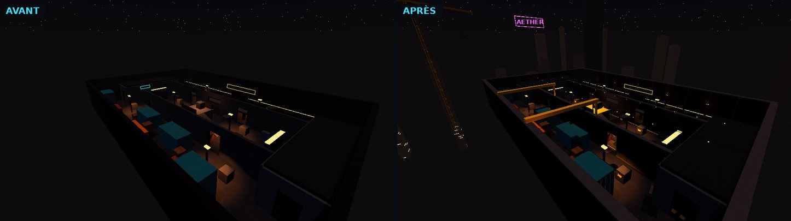
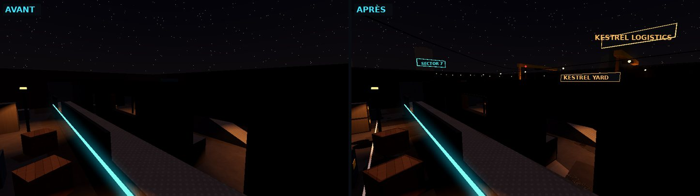
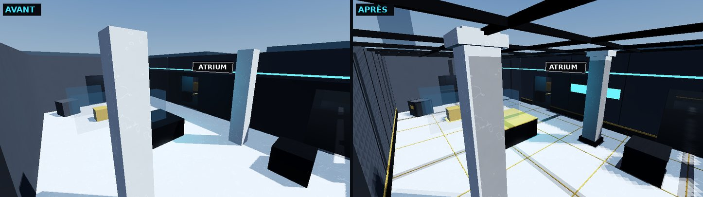
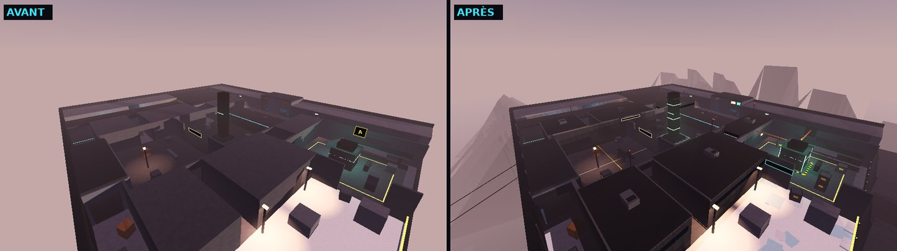
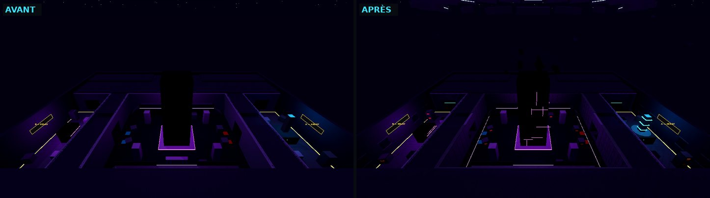
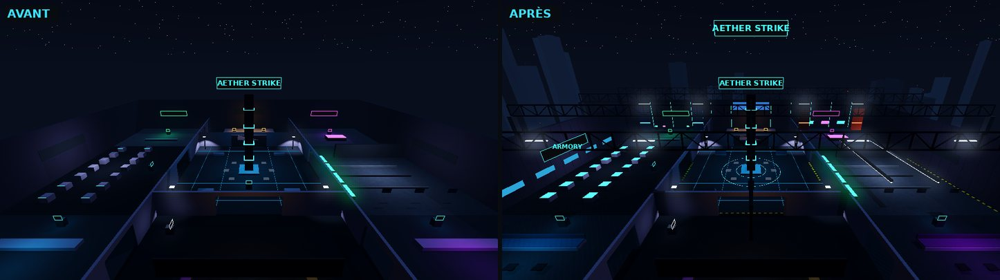

# 12. Audit complet et plan de refonte

> Diagnostic établi **avant** toute modification, en lisant le code et en mesurant le
> projet avec les outils du dépôt et des skills (`roblox-technical-director`,
> `roblox-render-performance`, `roblox-ui-design-system`…). Les corrections et
> améliorations réalisées ensuite sont listées en fin de document (§ 6).

## 1. Périmètre analysé

| Élément | Volume |
|---|---|
| Code Luau strict | 104 modules, 32 360 lignes (`src/`) |
| Réseau | 33 remotes déclarés dans `Shared/Net/Net.luau`, tous branchés via `ServerNet` (rate limit → schéma `Guard` → exécution protégée) |
| Serveur | 21 services, `MatchInstance` (machine à états), `MapKit`/`MapBuilder` + 5 plans de cartes |
| Client | 14 contrôleurs, lobby (8 modules), kit d'UI, armes procédurales (modèles, animateur) |
| Contenu | 14 armes, 112 skins, 5 modes, 4 cartes compétitives + hub |
| Tests | 91 tests Lune (règles, combat, maps, utilitaires) |

Méthode : lecture des systèmes critiques (boot, réseau, combat, compensation de latence,
personnages, match, données, anti-triche, mouvement, caméra, effets, audio, UI, cartes),
puis mesures : analyse stricte, tests, graphe de dépendances, export des cartes
(`tools/export_maps.luau`), composition des scènes, contraste des jetons d'UI
(`contrast.py`).

## 2. Bilan par domaine

| Domaine | État constaté | Forces | Faiblesses |
|---|---|---|---|
| Architecture & code | Solide | services à cycle Init/Start, bus `GameEvents`, règles pures testées, 0 erreur stricte, 0 cycle | quelques écritures de profil contournent le replica |
| Sécurité | Solide | validation de chaque paquet, 13 contrôles de tir, audit statistique du spread, anti-speed/noclip/fly, pot de miel | la mêlée ignore l'état « occupé » (pose/désamorçage) |
| Combat / armes | Solide | prédiction client identique au serveur (graine partagée), lag compensation bornée, pénétration | **killcam tronquée à ~1 s** (historique trop court) |
| Mouvement / caméra | Solide | modèle « Source-like », counter-strafe, buffer/coyote, caméra visée/rendu séparés | aucun respect de `ReducedMotionEnabled` |
| Cartes (level design) | Jouable | trois voies lisibles, lignes de vue testées, callouts | **blockout brut** : 169 à 246 primitives par carte, boîtes unies, caisses cubiques, aucun décor, aucun horizon |
| Environnement / props | Absent | — | pas de mobilier, de câbles, de tuyaux, de signalétique au sol ni de dressing |
| Éclairage / atmosphère | Partiel | profils par carte (heure, Atmosphere, étalonnage, bloom) | pas de `Sky` dédié, ni `LightingStyle`, ni nuages ; météo annoncée (pluie à Kestrel) absente |
| Matériaux | Basique | palette cohérente | aplats uniformes, aucune variation de teinte, aucun détail de surface |
| VFX | Correct | flash, traceurs, impacts, douilles, chargeurs, effets de kill, tout est poolé | **objets poolés recyclés par des `task.delay` périmés** (trous qui disparaissent, double libération) ; aucun effet d'ambiance |
| Audio | Correct (placeholder) | mix par groupes, couches de tir, version lointaine, occlusion, ducking | **filtre bas-PV inactif sur les impacts** ; une seule boucle d'ambiance par carte, aucune réverbération de lieu, aucun son ponctuel |
| UI / UX | Bonne | jetons de thème, kit typé, HUD complet, responsive | `textFaint` illisible (2,6–2,9:1) utilisé pour des informations ; pas de zones sûres mobiles ni de préférences d'accessibilité Roblox |
| Performance | Très large marge | pools, LOD d'animation, cartes légères | (marge à investir dans le visuel, mesurée par SceneAudit) |
| Organisation | Bonne | docs générées depuis le code, outils de vérification | — |

## 3. Problèmes détectés, par priorité

### P0 — bugs, sécurité, systèmes cassés

1. **Killcam tronquée** — `LagCompensationService` ne garde que 64 échantillons
   (≈ 1,07 s à 60 Hz) alors que `CombatService.sendKillcam` demande 3,2 s et que le client
   rejoue jusqu'à 3,4 s : le replay montre à peine la dernière seconde.
2. **Pools d'effets** — `EffectsController` libère trous de balle (10 s) et impacts
   (1,2 s) par `task.delay` sans jeton de génération : quand le pool recycle de force un
   objet, l'ancien délai efface ou libère l'objet réutilisé (trous qui disparaissent,
   double libération, traceurs partagés par deux entrées).
3. **Filtre bas-PV** — `AudioController.setLowHealth` ne met à jour que le filtre du
   groupe `Weapons` ; le clone posé sur `Impacts` reste inactif.
4. **Loadout en match** — `MatchInstance.selectLoadout` écrit `data.Loadout` directement :
   le replica du profil n'est pas notifié (UI du lobby désynchronisée au retour).
5. **Mêlée pendant une action d'objectif** — `CombatService.onMelee` ne vérifie pas
   l'attribut `Busy` (le tir le vérifie) : un client modifié peut frapper en posant la
   charge.
6. **Ordre du streaming** — `MapService.createArena` fixe `ModelStreamingMode` après que
   `MapBuilder` a parenté le modèle (réplication initiale dans le mauvais mode).

### P1 — gameplay et ressenti

- Ressenti des armes : flash de bouche (simple sphère) et impacts peu lisibles ; trous de
  balle sans variation.
- Pas de son de pas propre au bois, au verre, à la grille ; matériaux des cartes peu
  différenciés à l'oreille.

### P2 — monde

- Cartes au stade blockout (voir § 2) : aucune silhouette lointaine, aucun dressing, des
  surfaces géantes uniformes ; le hub n'a ni mobilier ni horizon.

### P3 — visuel

- Ciel par défaut, `Technology` seul (déprécié) sans `LightingStyle`, ombres non réglées.
- Aucune variation de matière, aucun détail de bord (profilés, plinthes, joints).
- Aucun VFX d'ambiance (pluie, neige, poussière, vapeur).

### P4 — immersion

- Ambiance sonore : une boucle par carte ; pas de réverbération par lieu ni de sons
  ponctuels ; pas d'orage à Kestrel malgré la pluie annoncée.

### P5 — finition

- Contraste de `textFaint`, zones sûres (encoche mobile), `ReducedMotionEnabled`,
  `PreferredTransparency`.

## 4. Ce qui ne sera pas remplacé (et pourquoi)

Le pipeline de tir (prédiction + validation + compensation), le réseau, la couche de
données (verrou de session), le modèle de mouvement, la caméra, la machine à états de
match et le matchmaking fonctionnent, sont testés et cohérents : ils restent en place.
Les améliorations s'y branchent sans changer leurs contrats (règle « ne rien améliorer
aveuglément »).

## 5. Plan d'action

1. P0 : corriger les six problèmes ci-dessus, avec tests là où la logique est pure.
2. Outil de prévisualisation 3D des cartes hors Studio (`tools/render_view.py`) pour
   juger le travail visuel et produire des avant/après.
3. P2 : couche de décor par carte (non collidable, non bloquante pour les tirs, testée),
   horizons lointains, mobilier du hub et de Helix ; métriques de gameplay inchangées.
4. P3 : ciel, `LightingStyle`, ombres, nuages ; variation de matière ; VFX d'ambiance
   (pluie, neige, poussière, vapeur) côté client, désactivables.
5. P4 : zones d'ambiance par carte (lits sonores, réverbération de lieu, sons ponctuels),
   orage discret à Kestrel (respecte « flashs réduits »).
6. P5 : accessibilité de l'UI, contraste, zones sûres ; budgets SceneAudit vérifiés.

## 6. Réalisé

### 6.1 Corrections (P0)

| Problème | Correction | Fichiers |
|---|---|---|
| Killcam tronquée | historique dédié de 20 Hz sur 4 s, utilisé tel quel par la killcam | `LagCompensationService`, `CombatService` |
| Pools d'effets | jeton de génération par objet ; listes animées plafonnées sous la taille des pools | `EffectsController` |
| Filtre bas-PV des impacts | tous les filtres pilotés ensemble | `AudioController` |
| Loadout en match | écriture par le replica du profil (répliquée + persistée) | `MatchInstance` |
| Mêlée pendant une action | refus si `Busy`, comme le tir | `CombatService` |
| Ordre du streaming | mode fixé avant le parentage de l'arène | `MapBuilder`, `MapService` |
| Outillage Lune | `CFrame.lookAt` de Lune 0.10 est faux (axe Z inversé) : rampes, murs en biais et caméras d'intro étaient mal orientés dans les tests et rendus ; le chargeur fournit un `lookAt` exact | `tests/lib/loader.luau` |

### 6.2 Monde (P2)

Habillage par carte (`src/Server/Maps/Dressing/*`) avec une bibliothèque de recettes
(`src/Server/Maps/Decor.luau`). Règles garanties par les tests de cartes : le décor ne
bloque ni tirs ni déplacements, il est fin (≤ 1 stud) ou au-dessus de 12 studs dans
l'espace de jeu, les volumes massifs sont hors limites ; les lignes de vue entre spawns
sont inchangées.

| Carte | Avant | Après | Lumières (ombrées) | Budget mobile |
|---|---|---|---|---|
| Hub | 230 parts | 2 042 | 31 (6) | respecté |
| KESTREL YARD | 184 | 2 206 | 25 (6, contre 7 avant) | respecté |
| HELIX VAULT | 169 | 1 081 | 22 (0) | respecté |
| SPIRE-9 | 246 | 1 399 | 14 (6) | respecté |
| MONOLITH | 219 | 1 336 | 9 (2) | respecté |

Rendus de prévisualisation (`tools/render_view.py`, hors Studio : composition, densité,
palette et éclairage ; le rendu final dans Roblox sera plus riche — matériaux texturés,
nuages, particules) :

### 6.3 Visuel, immersion, interface (P3 → P5)

- Éclairage : `LightingStyle = Realistic`, `PrioritizeLightingQuality`, matériaux 2022
  forcés (`MaterialService.Use2022Materials`), douceur des ombres, ciel et nuages par carte.
- Météo (`WeatherController`) : pluie, neige, poussière, étincelles ; coupure sous abri ;
  éclairs à Kestrel (tonnerre retardé, désactivés par « flashs réduits ») ; réglage
  « Météo et particules d'ambiance ».
- Son : sons ponctuels d'ambiance autour de l'auditeur, réverbération intérieur/extérieur
  par carte (préréglages courts : la lecture des pas reste nette), pas par matériau.
- Armes : flash de bouche en étoile, trous de balle variés.
- Interface : contraste de `textFaint`, `ReducedMotionEnabled`, `PreferredTransparency`,
  zone sûre des téléphones pour les éléments ancrés aux bords.

### 6.4 Reste à faire

Voir le rapport final de la refonte et `docs/11-roadmap.md` : play-tests en Studio
(ressenti, lisibilité de la météo, niveau sonore des ambiances), production des assets
définitifs (sons, textures de particules), mesure des FPS sur téléphone.
